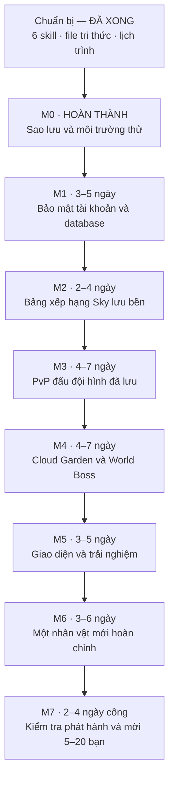
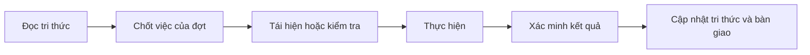

# Lịch trình hoàn thiện Eldorado / Busidol Offline

Lập ngày 24/09/2026. Phạm vi: PvP đấu đội hình đã lưu, nhóm thử kín 5–20 người.

## Cách đọc lịch

Đây là ước lượng sơ bộ, chưa gắn ngày bắt đầu hoặc cam kết ngày hoàn thành. Con số ban đầu được đặt rộng vì chưa biết giao thức client, mức xác minh chiến đấu và khối lượng hình ảnh. Theo phản hồi của người dùng, M0 được chia thành các lát ngắn: lát đầu 30–90 phút, toàn bộ M0 dự kiến hoàn thành trong một buổi nếu không gặp dữ liệu hỏng. Các mốc sau sẽ được ước lượng lại từ bằng chứng thực tế thay vì giữ mặc định 1–2 ngày cho một bước nhỏ.

Mỗi mốc được kiểm tra và cập nhật `TRI_THUC_DU_AN.md` trước khi bàn giao. Sửa lỗi và bảo mật đi cùng các mốc, không đợi tới cuối.

## Sơ đồ thứ tự

## Đầu ra và cửa kiểm tra

| Mốc | Đầu ra | Điều kiện đi tiếp |
|---|---|---|
| Chuẩn bị | 6 skill và tài liệu làm việc | Kiểm tra file cài đặt; tri thức có nguồn và trạng thái |
| M0 | Bản sao phục hồi được, môi trường thử, sơ đồ API | Không ghi thử vào tài khoản thật; biết nhánh client đang dùng |
| M1 | Phiên đăng nhập và nền dữ liệu trận/mùa/thưởng | Không giả được tài khoản; giao dịch không ghi dở; phục hồi được |
| M2 | Top Sky và hạng cá nhân thực | Ba tài khoản thấy cùng bảng; restart giữ điểm; gửi trùng không cộng lại |
| M3 | PvP trọn luồng và bảng hạng | Đấu người offline; đội hình chốt; điểm/thưởng lưu đúng; nêu rõ mức xác minh kết quả |
| M4 | Cloud và boss theo đợt | Vé/giờ/HP/đóng góp/thưởng nhất quán khi nhiều người cùng chơi |
| M5 | Màn hình và hướng dẫn dễ dùng | Dùng được trên máy tính/điện thoại; lỗi mạng có cách xử lý |
| M6 | Một nhân vật chơi được | Có đủ hình/hoạt ảnh, kỹ năng, lưu dữ liệu và kiểm tra cân bằng |
| M7 | Bản chơi thử, hướng dẫn, hình/clip/lời mời | Thử 3–5 người trước, sửa lỗi chặn rồi mở 5–20; không còn lỗi mất dữ liệu/nhầm tài khoản/nhận thưởng lặp trong bộ kiểm tra |

## Các mốc bàn giao dễ kiểm chứng

1. **Bàn giao đầu tiên, sau M2:** bảng Sky hoạt động thật. Chốt lại thời gian sau khi M0 đo xong giao thức thực tế.
2. **Sau M4:** PvP, Sky, Cloud và World Boss có luồng chơi và dữ liệu chung.
3. **Sau M7:** bản thử kín có giao diện cải thiện, một nhân vật mới và tài liệu mời bạn bè.

Lịch sẽ được ghi theo giờ hoặc buổi cho các bước ngắn. Nếu việc xác minh chiến đấu cần mô phỏng server lớn hơn dự kiến, sẽ tách thành hạng mục riêng và điều chỉnh trước khi nhận cam kết.

## Nhịp làm việc cho mỗi đợt

Kế hoạch kỹ thuật và tiêu chí đầy đủ nằm trong [KE_HOACH_PHAT_TRIEN.md](KE_HOACH_PHAT_TRIEN.md). Kiến thức tích lũy nằm trong [TRI_THUC_DU_AN.md](TRI_THUC_DU_AN.md).
